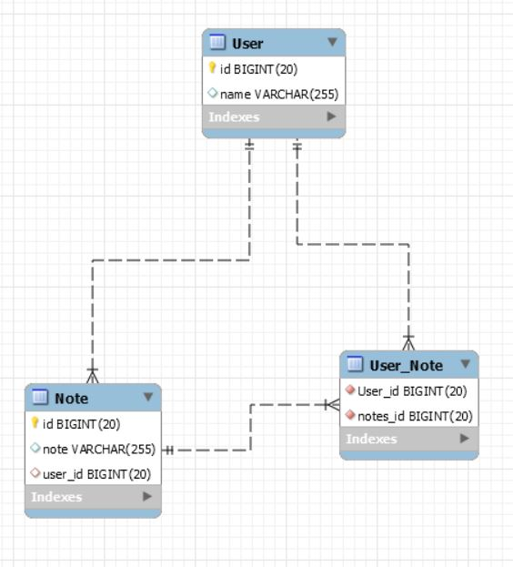

# Tema Servlet

Andrei Petru Ștefănie, SDI, 244

## Cerinte

Tema are ca scop familiarizarea cu tehnologiile EJB, JPA, Wildfly, Glassfish si JNDI.

Realizarea unei aplicaţii care să folosească EJB, JPA, Servleturi, eventual JSP. Aplicatia va trebui să contină un server ce să gestioneze minimum două tabele în DB care să aibă relaţii între ele. Mai trebuie să conţină doi clienţi, unul care să apeleze serverul prin JNDI, celălalt să folosească injectarea EJB.

## Solutia Propusa

Aplicatia ajuta un utilizator sa isi gestioneze notilele. Printre functionalitati se numara:

- adaugarea de notite noi
- afisarea tuturor notitelor pentru un utilizator
- adaugarea notitelor folosind un client bazat pe JNDI
- afisarea notitelor clientilor
- compatibiliate cu Glassfish si Wildfly

## Arhitectura

### Baza de date

### Server

Aplicatia server detine persistenta entitatilor `User` si `Note` care sunt in relatie de **one-to-many** (`User` detine o lista de `Note`). Logica aplicatiei este pastrata in clasa `UserNotesBean` fiind de tip stateless. Aceasta implementeaza interfetele `LogicLocal` si `LogicRemote`.

Pentru functiile implementate din `LogicLocal` se folosesc clasele de entitati `User` si `Note` iar pentru functiile implementate din `LogicRemote` care va fi folosita la invocarea remote prin `JNDI` se folosesc clasele de tip Data Tansfer Object `NoteDTO` si `UserDTO`.

### Client

Aplicatia client care este de tip servlet foloseste doua fisiere statice pentru randare: `note.jsp` pentru afisarea aplicatiei propriu-zise si `error.jsp` pentru afisarea erorilor.

Aplicatia client care se foloseste de invocarea `JNDI` este facuta pentru a fi rulata pe Wildfly. Aceasta contine interfata folosita in aplicatia server `LogicRemote` si obiectele de tip DTO, `NoteDTO` si `UserDTO`. Aceasta este o aplicatie simpla de consola care initializeaza parametrii necesari pentru `JNDI` si apoi invoca printr-un obiect proxy, obiectul de tip stateless bean din aplicatia server, iar apoi executa cateva operatii cu acesta.

## Build si Deployment

Aplicatia foloseste **gradle** pentru build. Din directorul server, se ruleaza comanda `clean build deployGlassfish deployWildfly`. Aceasta va build-ui atat aplicatia in format war, cat si va face deploymentul acestuia pe serverele Glassfish si Wildfly.

Proiectul are la baza mai multe task-uri de gradle pentru o modularizare mai buna.

## Referinte

- Exemplele de la curs http://www.cs.ubbcluj.ro/~florin/TPJAD/ExempleSurseDocumentatii/ (6JPA2)
- Documentatia Gradle https://docs.gradle.org/current/userguide/tutorial_using_tasks.html
