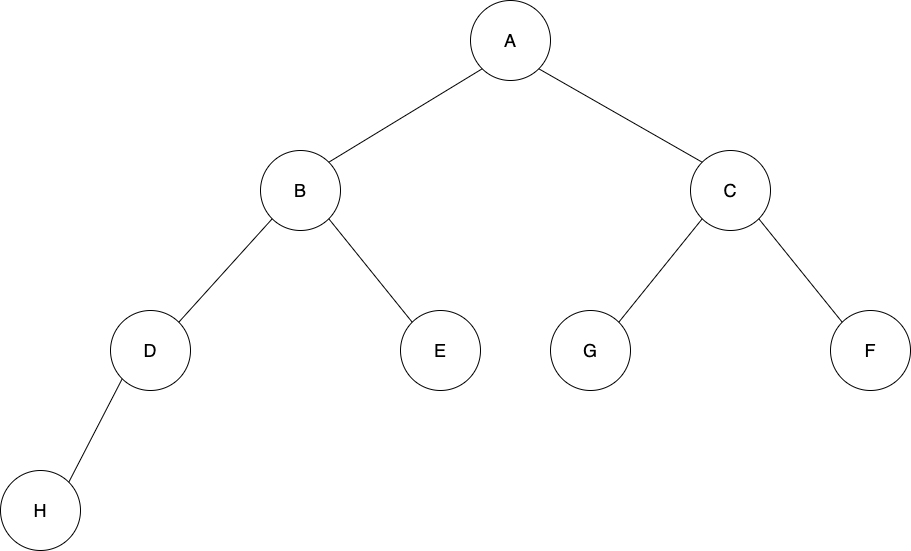

# 5 Programs

This project provides the solution to an IO-related problem in 5 different languages. The implementations should be as similar as possible, such as similar naming conventions, similar patterns, and similar input and output.

## Requirements

**Post-order binary tree traversal**. The tree is specified in a file stored on the disk as follows:
`(node id, parent id, left/right child, value)`. The path to the file is specified as a CLI argument to the program.

There is no limit to the size of the tree.

### Input

See an example in [input.json](input.json).

### Output

For the provided example, the expected output is `H, D, E, B, F, G, C, A`

## Implementations

### C#

The C# implementation requires .Net for building it. It was developed and tested using Microsoft .NET SDK 6.0.201 (arm64). You can run it without building the project using the command `dotnet run ../input.json` or build it with `dotnet build --configuration Release` and run the generated executable with `./bin/Release/net6.0/Tree ../input.json`.

The program should run with .NET Core 3.0 or newer.

It uses the system library Json for parsing JSON files.

### Kotlin

The Kotlin implementation uses Gradle (7.4.1) for building and Gson for handling JSON parsing. Build the application with `gradle clean build` and the run the program with `java -jar app/build/libs/app.jar ../input.json`.

It uses the 3rd party library, Gson, for parsing JSON files.

### Go

The Go implementation can be run by building the program with `go build -o tree .` and executing it with `./tree ../input.json`. The program was developed and tested with **golang 1.18** on arm64, but should work with any recent version of go and architecture.

It uses the standard packages `encoding/json`, `fmt`, `os`.

### Node.js

The Node.js program can be executed directly as a CLI program granted that Node.js is installed on the system: `./tree.js ../input.json`. Alternatively, you can execute it with `node tree.json ../input.json`.

The program was developed and tested with **Node v16.14.0** altought any recent version (supporting promise-based `fs`, classes, and object destructuring) should be able to run it.

It makes of the `fs` package that comes with any Node.js installation.

### PHP

The PHP program can executed either directly as a CLI program with `./tree.php ../input.json` or as a PHP program with `php ./tree.php ../input.json`.

The program was developed and tested with `PHP 8.1.4`, but any recent PHP installation should be able to run it.

It has no dependencies.
